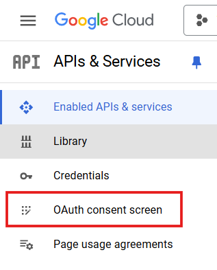

<!-- TODO: review this and rewrite for accessibility if needed -->


Upload all your plaintext files to Google Drive with **GDocify**. This app integrates with the Google Docs API and Google Drive API, allowing you to convert .txt files into Google Docs and upload them to a specific folder of your choice.

## Prerequisites

Ensure you have a stable version of Node.js and Git installed on your system (tested with npm version 10.8.2) and a free Google Cloud Platform Account. This is required for API setup and credential configuration but, fortunately, easy to set up.

## Setup Instructions

### Fork the Repository

Fork this repository to your GitHub account, then clone the forked repository to your local machine:

```bash
git clone https://github.com/your-username/GDocify.git
cd GDocify
```

### Set Up Google Cloud Project

First, sign into or create a free [Google Cloud Platform](https://console.cloud.google.com/) account, then create a new project. Or, click this link to go straight to the New Project page: \
https://console.cloud.google.com/projectcreate \
Name the project GDocify or whatever other name you want. You can leave the location as "No organization".

Next, enable the Google Drive and Google Docs APIs.

1. Select Hamburger Menu<br>
   
1. Select View All Products, then APIs & Services<br>
   
1. Select ENABLE APIS AND SERVICES<br>
   
1. Search for Google Drive API, select it, then select ENABLE. Do the same for Google Docs API<br>
   

---

### Configure OAuth Consent Screen

Before you can use your app, you must configure the OAuth Consent Screen.

1. From APIs & Services, navigate to OAuth Consent Screen<br>
   <br>
1. Select External for User Type, then select the Create button. In the "OAuth consent screen" page, fill out the following then select SAVE AND CONTINUE.

   - `App name` as GDocify or whatever other name you want
   - `User support email` with your email
   - `Email addresses` with your email

1. In the "Scopes" page, select ADD OR REMOVE SCOPES<br>
   

1. Manually the following scopes by copying and pasting these links into the input box at the bottom and selecting ADD TO TABLE:

   - `https://www.googleapis.com/auth/documents`
   - `https://www.googleapis.com/auth/drive`

     

1. Verify the `.../auth/documents` and `.../auth/drives` boxes are checked, then select UPDATE then SAVE AND CONTINUE
   

1. In the "Test users" page, select ADD USERS and input your email. Select ADD then SAVE AND CONTINUE
1. Review the "Summary" page before selecting BACK TO DASHBOARD

### Configure OAuth Credentials

1. From APIs & Services, navigate to Credentials<br>
   
1. Select CREATE CREDENTIALS then OAuth Client ID<br>
   
1. Under `Application type`, select Desktop app. Then, select CREATE. OPTIONAL: Change name to whatever you want
1. Once your OAuth client is created, select DOWNLOAD JSON<br>
   
1. Rename the downloaded file to `credentials.json` and move it into the repo's `config` directory.

## Usage Instructions

### Step 1: Update Folder Name

1. Open the `index.js` file.
2. Locate the `FOLDER_NAME` variable and set it to the name of the folder you want to create your files in:

   ```javascript
   const FOLDER_NAME = "YourFolderName";
   ```

   **Note**: Google Drive doesn't enforce unique folder names. If multiple folders share the same name, the script retrieves the folder ID of the most recently modified folder by the user. I plan to implement paths to select folders in future updates.

### Step 2: Set Up NOTES folder

1. Open your `NOTES` folder. Delete `Oh, the Places You'll Go!.txt`.
2. Move or paste all the .txt files you want to upload into the `NOTES` folder

### Step 3: Run the Project

1. Open your terminal and navigate to the project's root directory.
2. Run the following command:
   ```bash
   npm run gdocify
   ```

This command executes the script, interacting with the Google Docs and Drive APIs as configured.

## Notes

- If the folder name specified in `index.js` does not exist in your Google Drive the script will throw an error.
- Be cautious of quota limits for Google Drive and Docs API usage.

## Helpful Resources

- [Creating a Google Cloud Project](https://developers.google.com/workspace/guides/create-project#google-cloud-console)
- [Google Docs API Documentation](https://developers.google.com/docs)
- [Google Drive API Documentation](https://developers.google.com/drive)
- [Node.js Documentation](https://nodejs.org/en/docs)

---
